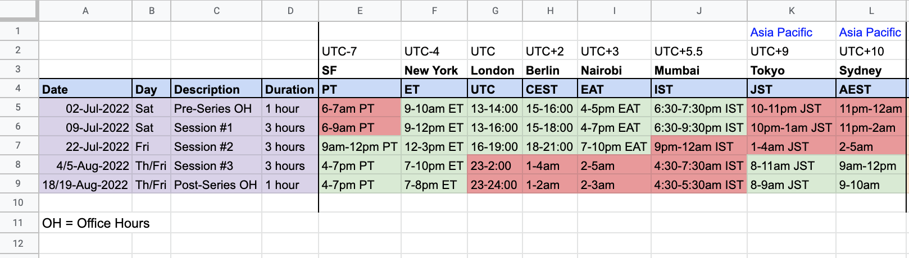

(2022_07/schedule)=
# Sprint schedule

:::{include} schedule_table.md
:::

:::{dropdown} Open dropdown for spreadsheet with times in more time zones
:icon: clock

<iframe src="https://docs.google.com/spreadsheets/d/e/2PACX-1vSJ_x4V63aji-WmarsgEyj9eS_Cp0DB5m647TZdNjYj03nPQq0u0Q6eKPGhHrw-8Ugp16KhAg-AgLkK/pubhtml?widget=true&amp;headers=false"  height="3200" width="750"></iframe>
:::

## Schedule with Timezones

   

## Exportable calendar

<iframe src="https://calendar.google.com/calendar/embed?src=pymc.devs%40gmail.com" style="border: 0" width="800" height="600" frameborder="0" scrolling="no"></iframe>
