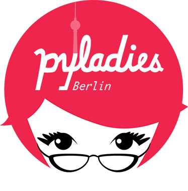
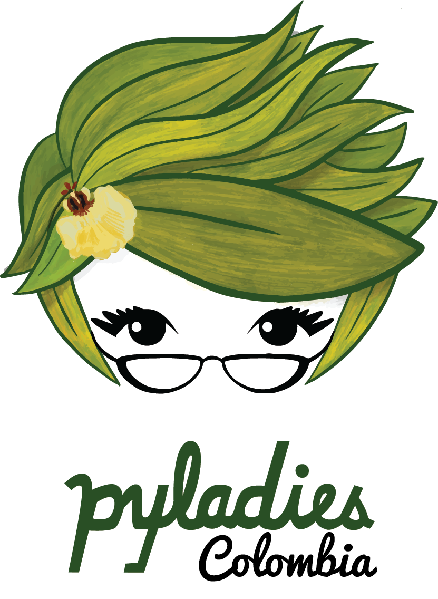
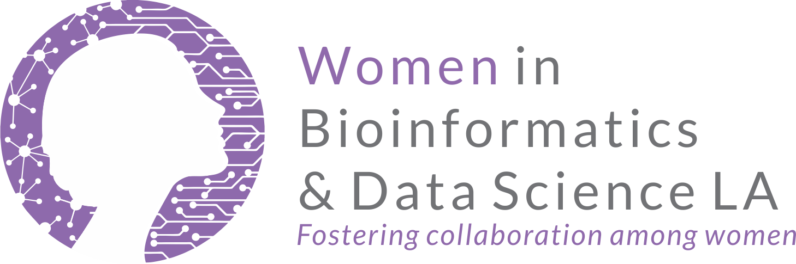
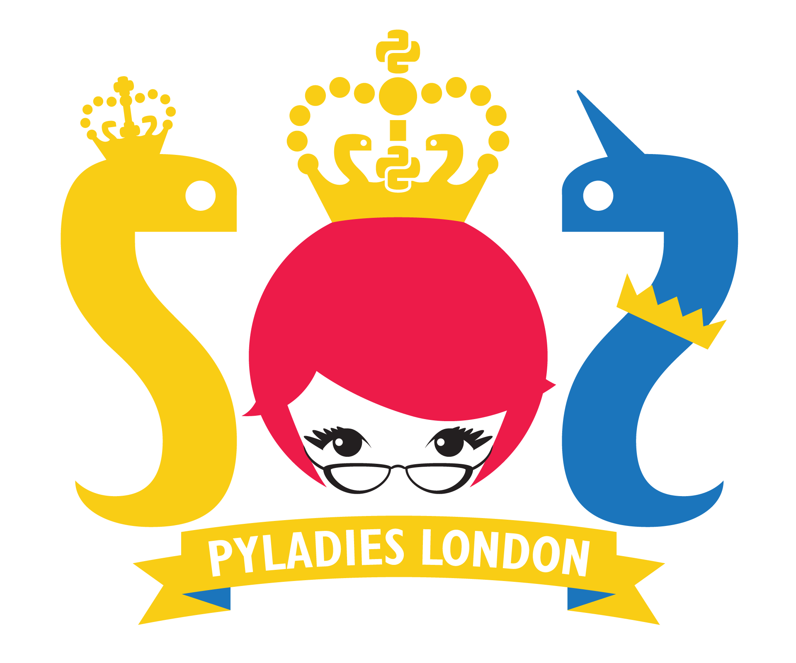

# Community Partnership

(become_community_partner)=
## Become a Community Partner

Community Partners are organizations who support our mission and share our event for outreach.  Data Umbrella will add the Name, Logo and Website Link to this page to bring visibility to your community.  If you would like to be a community partner, please contact us ({{ du_email }}).

We are providing a social media kit with information for sharing with your community:

::::{div} sd-d-flex-row sd-align-major-center
:::{button-ref} media_kit
:color: primary
:ref-type: myst
:class: sd-fs-5

Social Media Kit {material-regular}`share;3em`
:::
::::

## Community Partners

::::{grid} 1 1 2 2
:::{grid-item-card}
:link: https://www.pythonghana.org
:shadow: none
:class-card: border-0

Python Ghana is an organisation of technology enthusiasts who seek to promote and advance the use of technology. Open to residents of all countries.
:::
:::{grid-item-card}
:link: https://ghana.pyladies.com
:shadow: none
:class-card: border-0

PyLadies Ghana aims to provide a friendly support network for women and a bridge to the larger Python world.
:::

:::{grid-item-card}
:link: https://www.womeninanalytics.com/
:shadow: none
:class-card: border-0

An Analytics Community. Featuring Women. For Everyone.
:::
:::{grid-item-card}
:link: https://nyc.pyladies.com
:shadow: none
:class-card: border-0

We are the New York City chapter of PyLadies, an international community of women and non-binary people in tech.
:::
:::{grid-item-card}
:link: https://berlin.pyladies.com/
:shadow: none
:class-card: border-0

PyLadies Berlin helps women and non-binary people to become active participants and leaders in the Python community.
:::

:::{grid-item-card}
:link: https://www.meetup.com/pyladies-tunis/
:shadow: none
:class-card: border-0

PyLadies Tunis is an initiative under the Python Software Community. We want to maintain a friendly support network for women and all of those who are interested in Python.
:::

:::{grid-item-card}
:link: https://www.meetup.com/pyladiesparis/
:shadow: none
:class-card: border-0

We're PyLadies Paris! We organize meetups, workshops and gatherings around Python for women in Paris and online. We aim to share experience and good practices, learn, and be a friendly community for Python enthusiasts!
:::

:::{grid-item-card}
:link: https://twitter.com/pyladies_co
:shadow: none
:class-card: border-0

We are a community that motivates women to use technology and code. Everyone is welcome here, and it is a diverse and inclusive group.
:::

:::{grid-item-card}
:link: https://wbds.la
:shadow: none
:class-card: border-0

Fostering collaboration among women.
:::

:::{grid-item-card}
:link: https://www.meetup.com/pyladieslondon/
:shadow: none
:class-card: border-0

We are a mentorship group for marginalized genders on a mission is to promote, educate and advance a diverse Python community.
:::
::::
