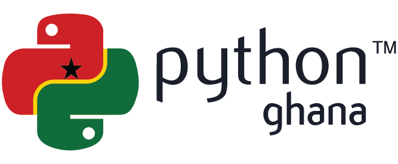

# Community Partnership

## Become a Community Partner

Community Partners are organizations who support our mission and share our event for outreach.  Data Umbrella will add the Name, Logo and Website Link to this page to bring visibility to your community.  If you would like to be a community partner, please contact us ({{ du_email }}).

Our event series can be shared in one or more of the following ways:  
- Event website: https://pymc-data-umbrella.xyz/en/latest/
- Event registration form:  https://tinyurl.com/du-pymc-os-ws
- Tweet:  https://twitter.com/DataUmbrella/status/1538875289652142080
- LinkedIn post: ​​https://www.linkedin.com/feed/update/urn:li:activity:6944647561630662656
- Social media card:  https://raw.githubusercontent.com/pymc-devs/pymc-data-umbrella/main/_static/banner_2022_07/2020_07_banner.png
- Meetup event: can share links or cross-post the event with your Meetup group
    - Pre-series Office Hours | Jul 2 (Saturday) | 13 UTC | 1 hour | [MeetUp](https://www.meetup.com/data-umbrella/events/286552154/)
    - Working Session #1      | Jul 9 (Saturday) | 13 UTC | 3 hours| [MeetUp](https://www.meetup.com/data-umbrella/events/286552452/)
    - Working Session #2      | Jul 22 (Friday)  | 16 UTC | 3 hours| [MeetUp](https://www.meetup.com/data-umbrella/events/286628677/)
    - Working Session #3      | Aug 4/5 (Th/Fr)  | 23 UTC  | 3 hours | [MeetUp](https://www.meetup.com/data-umbrella/events/286628723/)
    - Post-series Office Hours [^1] | Aug 18 (Sat) | 23 UTC| 1 hour  | [MeetUp](https://www.meetup.com/data-umbrella/events/286628791/)
- Via Slack, Discord, Facebook
- Email copy (button to copy all text available at the top right of the code block)

  ```none
  We [insert org name] are excited to share that we are a Community Partner with Data Umbrella for their upcoming open source working sessions with the Python library PyMC.  PyMC is an open-source probabilistic programming language in Python.

  This is a beginner-friendly event.  Skills that are helpful to have: Git, GitHub, Markdown, Sphinx, statistics, python, Bayesian statistics.

  Additionally, we have a series of videos where participants can watch videos and add timestamps. There are lots of ways to participate and contribute to open source.

  More information on joining the event:
  a) Schedule of events: https://pymc-data-umbrella.xyz/en/latest/2022-07_sprint/schedule.html
  b) Complete this registration form: https://tinyurl.com/du-pymc-os-ws
  ```

## Community Partners

::::{grid} 1 1 2 2
:::{grid-item-card}
:link: https://www.pythonghana.org
:shadow: none
:class-card: border-0



Python Ghana is an organisation of technology enthusiasts who seek to promote and advance the use of technology. Open to residents of all countries.
:::
:::{grid-item-card}
:link: https://ghana.pyladies.com
:shadow: none
:class-card: border-0


PyLadies Ghana aims to provide a friendly support network for women and a bridge to the larger Python world.
:::

:::{grid-item-card}
:link: https://www.womeninanalytics.com/
:shadow: none
:class-card: border-0


An Analytics Community. Featuring Women. For Everyone.
:::