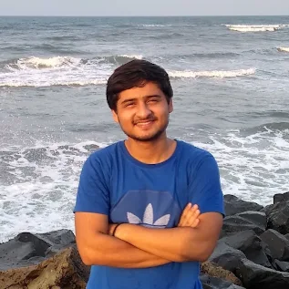

# Contributors

::::{dropdown} Add yourself as a contributor to the OS Working Session
:icon: person-add

The template shown rendered below for the Data Umbrella logo is available here
to help you copy it and add yourself to the contributor list.

Steps to follow are only mentioned here. For an extensive tutorial you can
read the page {ref}`pr_tutorial` and follow the steps mentioned below:

1. Fork and clone the repo. You can get to the repo on GitHub with the icon on the top right of the page
1. Create a feature branch.
1. Copy the contributor card template:

    ```
    :::{grid-item}

    

    Contributor Name

    Contributor Location

    [{fas}`globe`](https://www.dataumbrella.org/)
    [{fab}`github`](https://github.com/data-umbrella)
    [{fab}`twitter`](https://twitter.com/DataUmbrella)
    [{fab}`linkedin-in`](https://www.linkedin.com/company/dataumbrella/)
    :::
    ```

1. Open this file: `2022-07_sprint/sprint_parties/contributors.md`
1. Paste the template to the relevant section and update it with your personal info.

    :::{important}
    * Copy everything. The opening and closing _3 colon fences_ (`:::`) are necessary
    * Paste your card **under** the last card available (that is, after the last `:::`)
      but **above** the end of the grid (that is, before the one with 4 colons `::::`)
    * Empty lines are important for rendering. The empty line between "Contributor Name"
      and "Contributor Location" places them in different lines when rendering.
      The _lack_ of empty line between the multiple icons places them in the same
      line when rendering the website.
    * The image can be added to the repo ([`_static/contributors_2022_07` folder](https://github.com/pymc-devs/pymc-data-umbrella/tree/main/_static/contributors_2022_07))
      as part of the PR or be an external link like in the template.
      But it needs to be a _square image_.
    :::

    If you do not want to share a website, GitHub, Twitter and/or LinkedIn,
    those lines can be deleted, keeping an eye on not leaving empty lines between icons+links.

1. Commit your changes and open a Pull Request

::::

## Returning Contributors

::::{grid} 2 3 4 5
:gutter: 1

:::{grid-item}


Alihan Zihna

Dublin (Ireland)
:::
:::{grid-item}


Lucy Jimenez

[{fab}`github`](https://github.com/LucyJimenez)
[{fab}`linkedin-in`](https://www.linkedin.com/in/lucy-j/)
[{fab}`twitter`](https://twitter.com/JimenezLucyJ)

:::
:::{grid-item}


Juan Pablo Ibieta Jimenez

São Paulo, SP (Brasil)

[{fab}`github`](https://www.github.com/pibieta)
[{fab}`linkedin-in`](https://www.linkedin.com/in/pibieta)
[{fab}`twitter`](https://twitter.com/pabloibieta)
:::
::::

## New Contributors

::::{grid} 2 3 4 5
:gutter: 1

:::{grid-item}


Carlo Domenico Longo de Lemos

São Paulo, São Paulo (Brazil)

[{fab}`github`](https://github.com/vitaliset)
[{fab}`linkedin-in`](https://www.linkedin.com/in/carlo-lemos)
:::
:::{grid-item}


Mariya

(USA)

[{fab}`github`](https://github.com/mariyayb)
[{fab}`linkedin-in`](https://www.linkedin.com/in/mariya-b/)
:::
:::{grid-item}


Benjamin Senst

Berlin (Germany)
:::
:::{grid-item}


Saurabh Egham

Surrey	Egham, Surrey (UK)

[{fab}`github`](https://www.github.com/saurbhc)
[{fab}`linkedin-in`](https://www.linkedin.com/in/saurabhchopraa/)
[{fab}`twitter`](https://twitter.com/saurabhchopraa)
:::
:::{grid-item}


Zoe Braiterman

New York, New York (USA)

[{fab}`github`](https://github.com/zbraiterman)
[{fab}`linkedin-in`](https://www.linkedin.com/in/zoebraiterman/)
[{fab}`twitter`](https://twitter.com/zbraiterman)
:::
:::{grid-item}


Andrianina David Raharijao

NYC, United States

[{fab}`github`](https://github.com/Raharijao)
[{fab}`linkedin-in`](https://www.linkedin.com/in/andrianina-raharijao/)
:::
:::{grid-item}


Igor Kuvychko

Portland, OR (USA)

[{fab}`github`](https://github.com/kuvychko)
[{fab}`linkedin-in`](https://www.linkedin.com/in/igor-kuvychko-09ba759/)
[{fab}`twitter`](https://twitter.com/IgorKuvychko)
:::
:::{grid-item}


Safalta Kundra

Nagpur, Maharashtra (India)
:::
:::{grid-item}


Arun Ravi

Pune, Maharashtra (India)

[{fab}`github`](https://github.com/haricash)
[{fab}`linkedin-in`](https://www.linkedin.com/in/haricash/)
[{fab}`twitter`](https://twitter.com/haricash)
:::
:::{grid-item}


Jonathan Lindbloom

Los Alamos, NM (USA)

[{fab}`github`](https://github.com/jlindbloom)
[{fab}`linkedin-in`](https://www.linkedin.com/in/jonathanlindbloom-77232917/)
[{fab}`twitter`](https://twitter.com/qed404)
:::
:::{grid-item}


Benjamin Datko

[{fab}`github`](https://github.com/bdatko)
[{fab}`linkedin-in`](https://www.linkedin.com/in/bdatko-23802891/)
:::
:::{grid-item}


Rowan Gayle Schaefer
:::
:::{grid-item}


Dustin Burt

Columbus, Ohio (USA)

[{fab}`github`](https://github.com/dmburt)
[{fab}`linkedin-in`](https://www.linkedin.com/in/dustin-matthew-burt-760b112/)
:::
:::{grid-item}


Vikas Vishwakarma

Bhopal, Madhya Pradesh, India

[{fab}`github`](https://github.com/Icyshaman)
[{fab}`linkedin-in`](https://www.linkedin.com/in/vikas-vishwakarma-04b738193/)
:::
:::{grid-item}


Daniel Saunders

[{fab}`github`](https://github.com/daniel-saunders-phil)
[{fab}`twitter`](https://twitter.com/carolbasknrobns)
:::
:::{grid-item}


Yuan Li

New York
:::
:::{grid-item}


Sangam

Bangalore


[{fab}`github`](https://github.com/SangamSwadiK)
:::
:::{grid-item}


Prince Asiedu

Accra, Ghana

[{fab}`github`](https://github.com/PrinceAsiedu)
[{fab}`twitter`](https://twitter.com/PrinceA13827013)
[{fab}`linkedin-in`](https://www.linkedin.com/in/princeoforhasiedu/)
:::

:::{grid-item}



Rohan Sharma

Delhi, India

[{fab}`github`](https://github.com/Rohanfizz)
[{fab}`linkedin-in`](https://www.linkedin.com/in/rohanfizz/)
:::
:::{grid-item}

Ashutosh Negi


Delhi, India

[{fab}`github`](https://github.com/adkood/)
[{fab}`linkedin-in`](https://www.linkedin.com/in/ashutosh-negi-b08a32193/)
:::
::::
