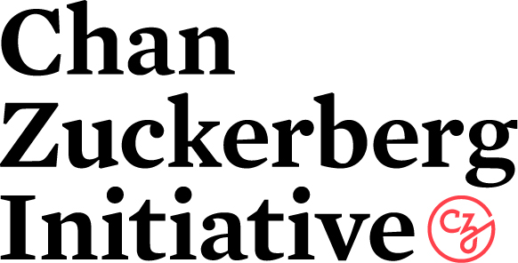

# Sprint parties
## Organizers
### Data Umbrella Organizers

::::{grid} 2 2 3 5
:gutter: 3

:::{grid-item-card}
:link: https://reshamas.github.io
:shadow: none
:class-body: sd-text-center
:class-card: border-0

Reshama Shaikh
:::
:::{grid-item-card}
:link: https://twitter.com/BerylKanali
:shadow: none
:class-body: sd-text-center
:class-card: border-0

Beryl Kanali
:::
:::{grid-item-card}
:link: https://github.com/symeneses
:shadow: none
:class-body: sd-text-center
:class-card: border-0

Sandra Meneses
:::
:::{grid-item-card}
:link: https://www.linkedin.com/in/sandy-weng-a0959762/
:shadow: none
:class-body: sd-text-center
:class-card: border-0

Sandy Weng
:::
::::

### PyMC Organizers

::::{grid} 2 2 3 5
:gutter: 3

:::{grid-item-card}
:link: TODO
:shadow: none
:class-body: sd-text-center
:class-card: border-0

Christian Luhmann
:::
:::{grid-item-card}
:link: https://reshamas.github.io
:shadow: none
:class-body: sd-text-center
:class-card: border-0

Reshama Shaikh
:::
:::{grid-item-card}
:link: https://oriolabrilpla.cat
:shadow: none
:class-body: sd-text-center
:class-card: border-0

Oriol Abril Pla
:::
:::{grid-item-card}
:link: https://twiecki.io/
:shadow: none
:class-body: sd-text-center
:class-card: border-0

Thomas Wiecki
:::
::::

### PyMC Mentors

::::{grid} 2 2 3 5
:gutter: 3

:::{grid-item-card}
:link: TODO
:shadow: none
:class-body: sd-text-center
:class-card: border-0

Christian Luhmann
:::
:::{grid-item-card}
:link: https://twiecki.io/
:shadow: none
:class-body: sd-text-center
:class-card: border-0

Thomas Wiecki
:::
::::

### About PyMC and Data Umbrella

[Data Umbrella](https://www.dataumbrella.org/) is a global community for underrepresented persons in data science. It is a fiscally hosted project of Open Collective, a registered 501(c)(3) non-profit based in California, USA. Data Umbrella: organizes online speaker series on data science and open source, organizes sprints / hackathons, curates resources on inclusive practices. All levels are welcome, beginners and experts.

[PyMC](https://www.pymc.io) is a probabilistic programming package for Python that allows users to fit Bayesian models using a variety of numerical methods, most notably Markov chain Monte Carlo (MCMC) and variational inference (VI). Its flexibility and extensibility make it applicable to a large suite of problems. PyMC is a non-profit project under NumFOCUS.

## Community partners

::::{grid} 1 1 2 2
:::{grid-item-card}
:link: TODO
:shadow: none
:class-card: border-0

TODO: Add short description: Python Ghana
:::
:::{grid-item-card}
:link: TODO
:shadow: none
:class-card: border-0

TODO: Add short description: PyLadies Ghana
:::
::::

## Data Umbrella Sponsors
::::{grid} 1 1 2 2
:::{grid-item-card}
:link: TODO
:shadow: none
:class-card: border-0

TODO: Add short description: Google
:::
:::{grid-item-card}
:link: TODO
:shadow: none
:class-card: border-0

TODO: Add short description: CZI
:::
:::{grid-item-card}
:link: TODO
:shadow: none
:class-card: border-0

TODO: Add short description: PyMC Labs
:::
::::

## Contributors

:::{include} contributors.md
:::
