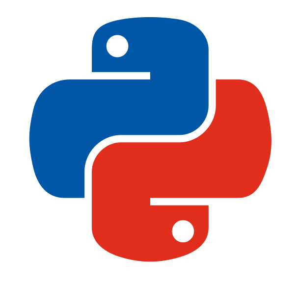
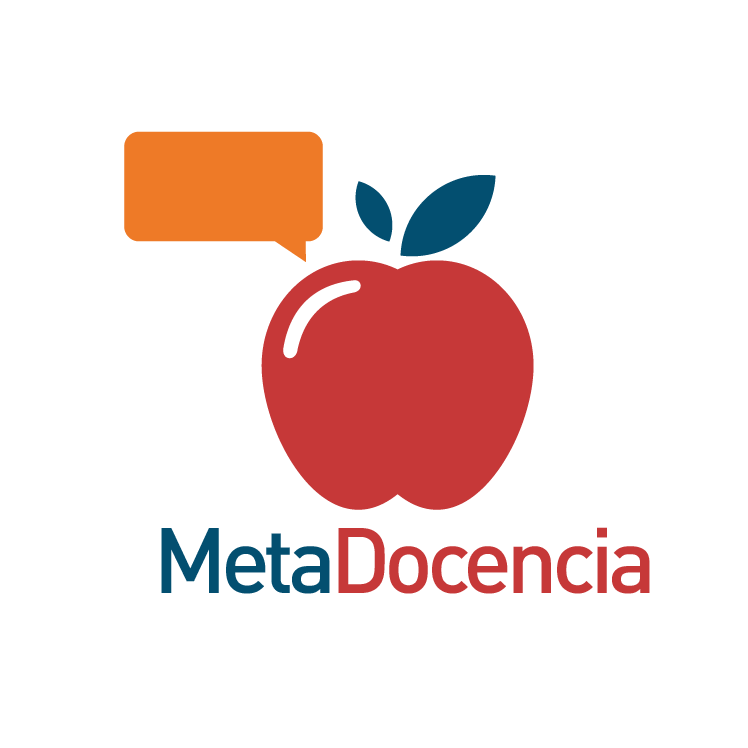
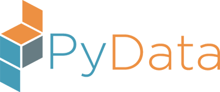

# Community Partnership

(become_community_partner)=
## Become a Community Partner

Community Partners are organizations who support our mission and share our event for outreach.  Data Umbrella will add the Name, Logo and Website Link to this page to bring visibility to your community.  If you would like to be a community partner, please contact us ({{ du_email }}).

We are providing a social media kit with information for sharing with your community:

::::{div} sd-d-flex-row sd-align-major-center
:::{button-ref} media_kit_ref
:color: primary
:ref-type: myst
:class: sd-fs-5

Social Media Kit {material-regular}`share;3em`
:::
::::

## Community Partners

::::{grid} 1 1 2 2
:::{grid-item-card}
:link: https://twitter.com/pyladies_co
:shadow: none
:class-card: border-0

**PyLadies Colombia:** We are a community that motivates women to use technology and code. Everyone is welcome here, and it is a diverse and inclusive group.
:::
:::{grid-item-card}
:link: https://www.pythonchile.cl
:shadow: none
:class-card: border-0

**Python Chile:** Official Chilean Python Community, a place to meet, learn, and empower Chilean Python developers.
:::
:::{grid-item-card}
:link: https://nyc.pyladies.com
:shadow: none
:class-card: border-0

**New York PyLadies:** We are the New York City chapter of PyLadies, an international community of women and non-binary people in tech.
:::
:::{grid-item-card}
:link: https://www.metadocencia.org/en/
:shadow: none
:class-card: border-0

**Metadocencia:** Co-Creating and Teaching Open Science in Spanish-speaking regions.
:::
:::
:::{grid-item-card}
:link: https://www.meetup.com/pydatanyc/
:shadow: none
:class-card: border-0

**PyData NYC:** Provides a forum for the community of users and developers of data analysis tools to share ideas and learn from each other.
:::
::::
