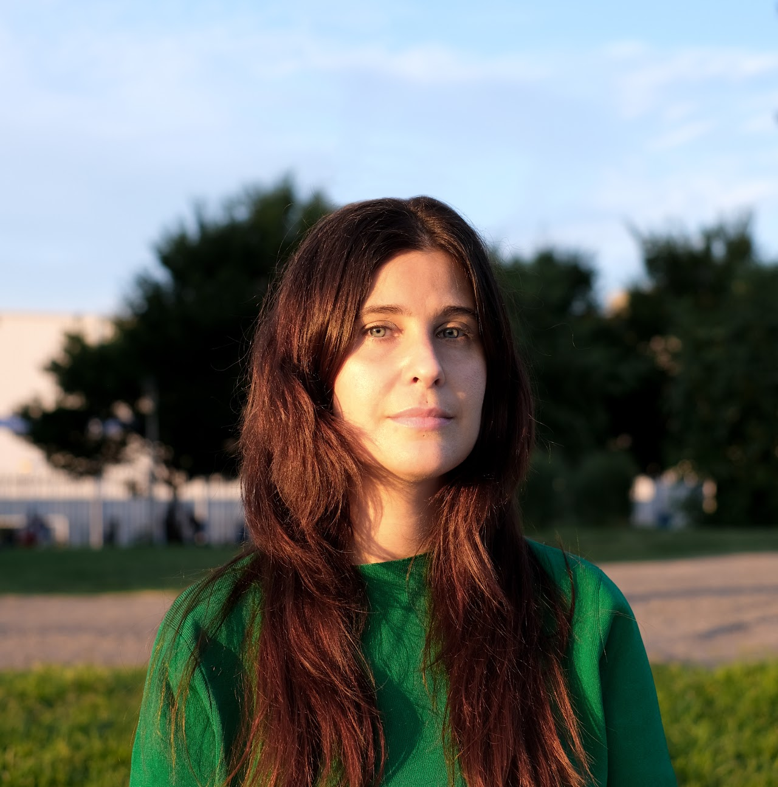

# Organizers
## Data Umbrella Organizers

::::{grid} 2 2 3 5
:gutter: 3

:::{grid-item}
:class: sd-text-center

Reshama Shaikh

[{fas}`globe`][reshama_web]
[{fab}`github`][reshama_github]
[{fab}`twitter`][reshama_twitter]
[{fab}`linkedin-in`][reshama_linkedin]
:::
:::{grid-item}
:class: sd-text-center

Beryl Kanali

[{fab}`twitter`](https://twitter.com/BerylKanali)
[{fab}`linkedin-in`](https://www.linkedin.com/in/beryl-kanali-260567185/)
:::
:::{grid-item}
:class: sd-text-center

Sandra Meneses

[{fab}`github`](https://github.com/symeneses)
[{fab}`linkedin-in`](https://www.linkedin.com/in/symeneses/)
:::
:::{grid-item}
:class: sd-text-center

 

Cristina Mulas Lopez

[{fab}`linkedin-in`](https://www.linkedin.com/in/cristina-mulas-00321a167/)
:::
::::

## PyMC Organizers

::::{grid} 2 2 3 4
:gutter: 5

:::{grid-item}
:class: sd-text-center

Christian Luhmann

[{fas}`briefcase`][christian_work]
[{fab}`twitter`][christian_twitter]
:::
:::{grid-item}
:class: sd-text-center

Reshama Shaikh

[{fas}`globe`][reshama_web]
[{fab}`github`][reshama_github]
[{fab}`twitter`][reshama_twitter]
[{fab}`linkedin-in`][reshama_linkedin]
:::
:::{grid-item}
:class: sd-text-center

Oriol Abril Pla

[{fas}`globe`](https://oriolabrilpla.cat)
[{fab}`github`](https://github.com/oriolabril)
[{fab}`twitter`](https://twitter.com/oriolabril)
:::

::::

## PyMC Mentors

::::{grid} 2 2 3 4
:gutter: 5

:::{grid-item}
:class: sd-text-center

Christian Luhmann

[{fas}`briefcase`][christian_work]
[{fab}`twitter`][christian_twitter]
:::
:::{grid-item}
:class: sd-text-center

Oriol Abril Pla

[{fas}`globe`](https://oriolabrilpla.cat)
[{fab}`github`](https://github.com/oriolabril)
[{fab}`twitter`](https://twitter.com/oriolabril)
:::
:::{grid-item}
:class: sd-text-center

Ravin Kumar

[{fas}`globe`](https://ravinkumar.com/)
[{fab}`github`](https://github.com/canyon289)
[{fab}`twitter`](https://twitter.com/canyon289)
:::
:::{grid-item}
:class: sd-text-center

Danh Phan

[{fas}`globe`][danh_web]
[{fab}`github`][danh_github]
[{fab}`twitter`][danh_twitter]
[{fab}`linkedin-in`][danh_linkedin]
:::
:::{grid-item}
:class: sd-text-center

Christopher Fonnesbeck 

[{fab}`linkedin-in`](https://www.linkedin.com/in/christopher-fonnesbeck-374a492a/)
:::
:::{grid-item}
:class: sd-text-center

Michael Osthege

[{fab}`linkedin-in`](https://www.linkedin.com/in/michael-osthege-7987a6130/)
:::
:::{grid-item}
:class: sd-text-center

Alexandre Andorra

[{fab}`linkedin-in`](https://www.linkedin.com/in/aandorra-pollsposition/)
:::
:::{grid-item}
:class: sd-text-center

Fernando Irarrázaval

[{fab}`github`](https://github.com/cuchoi)
:::
::::

Additionally, we thank all the PyMC team members who contributed by reviewing pull requests and assisting with outreach as well as [NumFOCUS](https://numfocus.org) for their support.

## Community Contributors

Community contributors help with various activities such as updating the event website, outreach and more. 

::::{grid} 2 2 3 4
:gutter: 5

:::{grid-item}
:class: sd-text-center

Cristián Maureira-Fredes

[{fab}`linkedin-in`](https://www.linkedin.com/in/cmaureir/)
:::

::::

## About PyMC and Data Umbrella

[Data Umbrella](https://www.dataumbrella.org/) is a global community for underrepresented persons in data science. It is a fiscally hosted project of Open Collective, a registered 501(c)(3) non-profit based in California, USA. Data Umbrella: organizes online speaker series on data science and open source, organizes sprints / hackathons, curates resources on inclusive practices. All levels are welcome, beginners and experts.

[PyMC](https://www.pymc.io) is a probabilistic programming package for Python that allows users to fit Bayesian models using a variety of numerical methods, most notably Markov chain Monte Carlo (MCMC) and variational inference (VI). Its flexibility and extensibility make it applicable to a large suite of problems. PyMC is a non-profit project under NumFOCUS.

[reshama_web]: https://reshamas.github.io
[reshama_github]: https://github.com/reshamas
[reshama_twitter]: https://twitter.com/reshamas
[reshama_linkedin]: https://www.linkedin.com/in/reshamas
[christian_work]:  https://www.stonybrook.edu/commcms/psychology/faculty/faculty_profiles/cluhmann
[christian_twitter]:  https://twitter.com/1010is10
[thomas_web]: https://twiecki.io
[thomas_work]: https://www.pymc-labs.io/team/thomas-wiecki/
[thomas_github]: https://github.com/twiecki
[thomas_twitter]: https://twitter.com/twiecki
[danh_web]: https://danhphan.github.io
[danh_github]: https://github.com/danhphan
[danh_twitter]: https://twitter.com/danhpt
[danh_linkedin]: https://www.linkedin.com/in/danhpt
