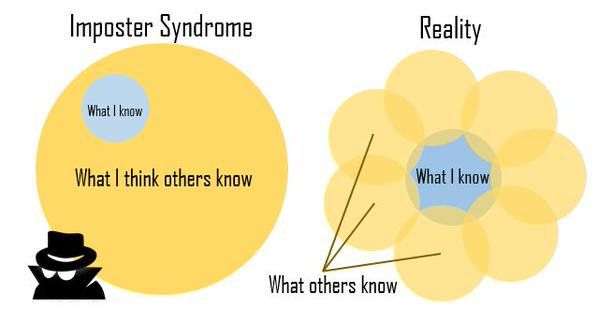

(docs_presentation)=
# Contributing to PyMC documentation

## An overview of PyMC documentation
The PyMC documentation is generated from two different GitHub repositories,
each containing different type of documentation:

* [pymc](https://github.com/pymc-devs/pymc):
  The pymc repository contains most reference content in the form of docstrings
  (strings attached to the Python object they describe), some guides about
  core functionality and the contributing docs.
(docs/pymc-examples-point)=
* [pymc-examples](https://github.com/pymc-devs/pymc-examples):
  The pymc-examples repository contains a collection of over
  90 notebooks with usage examples, in depth-explanations and tutorials about
  PyMC.

In this talk, we'll focus on contributing to pymc-examples,
which contains more and more diverse documentation.
We'll start with a description of the resource, its features
and how they relate to our pedagogical goals and then
dive into using those features to write clear,
pretty and well referenced technical documentation.

(docs/idea)=
## The idea: an executable book made from blogposts
:::{caution}
We won't explain how to set up a similar website, this would take another whole talk.

We will give an overview of the features available and about why we chose those
to then dive into our main goal for the talk: _How do you as a contributor
to PyMC documentation take advantage of them_
:::

Our wishlist:
* Easy to write
* Easy to execute, both when writing pages and when reading them.
  We should be able to run the code years from now.
* Browsable via tags and categories
* Searchable by itself and searchable from the pymc library documentation
* Citable resource
* Awknowledge the authors (without making it the focus)
* Automatic table of contents
* Accessible
* DRY: do not repeat yourself. Things shared between several notebooks should be done
  once when possible.

## The implementation: jupyter notebook + sphinx (+ extensions)

* Easy to write
  - Markdown
  - supported via sphinx+myst-parser
* Easy to execute, both when writing pages and when reading them.
  We should be able to run the code years from now.
  - Jupyter notebook combined with binder and google colab badges on top of every page
  - supported via sphinx+myst-nb and a custom html template for the badges
  - the environment used to run them is stored automatically thanks to the watermark library
* Browsable via tags and categories
  - supported via sphinx+ablog
* Searchable by itself and searchable from the pymc library documentation
  - supported via sphinx+pydata-sphinx-theme+readthedocs
* Citable resource
  - supported via zenodo+custom template
* Awknowledge the authors (without making it the focus)
  - supported via ablog+custom template
* Automatic table of contents
  - supported via sphinx+pydata-sphinx-theme
* Accessible
  - pydata-sphinx-theme is working on the accessibility of the theme and will continue to do so
* DRY: do not repeat yourself. Things shared between several notebooks should be done
  once when possible.
  - Centralized citations thanks to sphinx-bibtex, they are referenced in the docs with 2 keywords
  - Badges are automatic
  - Tags and categories are automatic
  - Table of contents is automatic
  - The 2 last sections with license info and citation are generated from a centralized source,
    with only 2 lines needed per notebook

To sum up, thanks to the work of several amazing people (both seasoned PyMC contributors and
new members working with us via Outreachy and {abbr}`GSoD (Google Season of Docs)`) and the funds we raised
during [PyMCon](https://discourse.pymc.io/c/pymcon/2020talks/15) and GSoD
we have changed most of our documentation infrastructure in the last 9 months.

You can see a huge change already:

::::{grid} 1 2 2 2

:::{grid-item-card} PyMC V4
:img-background: new.png
:link: https://www.pymc.io/projects/examples/en/latest/generalized_linear_models/GLM-model-selection.html
:::

:::{grid-item-card} PyMC V3
:img-background: old.png
:link: https://docs.pymc.io/en/v3/pymc-examples/examples/generalized_linear_models/GLM-model-selection.html
:::
::::

## The problem: too much docs?
Our **infrastructure** supports all of the points above, but only a handful of notebooks
have been updated to take advantage of them. So while we _could_ have all that, we
are still far from there!

## MyST: Markedly Structured Text
As we have just said, we have already configured the infrastructure for all the points above,
so you don't need to worry about that. The rest of the webinar will be a myst quickstart
targetted to contributing to pymc-examples.

### Core markup
MyST is a superset of ✨✨ **Markdown** ✨✨. Everything you know and love about markdown
is valid MyST markup: italics, code blocks, links, headers, lists...

However, markdown is too limited for technical writing and for resources
containing many files. MyST fills this gap by bringing to markdown all
the features of restructured text, a similar markup language designed
for technical documentation. It does so by extending markdown with
a few custom idioms and by supporting roles and directives (covered in the
following subsections).

**Targets**

Targets are used to define custom anchors that you can refer to elsewhere
in your documentation using roles.
They generally go before section titles, but they can also point to
lists or specific bullet points within a list.

Targets are creating with `(target_id)=` right before the section or
item we want them to point to. You can see the equal at the end as
an indicator that we are making the target id equivalent to what comes after.
Thus, referencing the target id becomes the same as referencing a section header
or bullet point.

**Math**

Like Jupyter notebooks, MyST supports using `$` for inline latex math expressions,
and `$$` for block expressions. Moreover, block mathematical expressions
can be given ids in order to reference them elsewhere using roles. Thus:

```markdown
$$
P(\theta|y) \propto P(y|\theta) P(\theta)
$$ (eq:bayes)
```

renders as:

$$
P(\theta|y) \propto P(y|\theta) P(\theta)
$$ (eq:bayes)

and can be referenced.

### Roles
Roles provide a way to specify arbitrary **inline** features.
Their base syntax is `` {role-name}`role-content` `` and can be divided
in two subgroups: cross-referencing and formatting roles, with the
cross-referencing use being far more important.

#### Cross-referencing roles
Cross-referencing roles can be used in two ways:

:::{list-table}
* - `` {role-name}`target` ``
  - `` {role-name}`custom text for link <target>` ``
:::

* `ref` and `numref` role is used to link to manually created targets, with `(id)=`,
  in figures... `ref` is replaced by the title of what we are linking to, `numref` (not valid
  for all objects) is replaced by its count.
* `doc` role is used to link using the path to a file
* `term` role is used to link to terms defined in {ref}`our glossary <pymc:glossary>`.
* python domain references: `mod` (module), `func` (function), `class` or `meth` (method)
  are used to link to python objects documented in the {ref}`pymc:api`.
  - These can also take a `~` character before the import path to show only the object,
    not its import path.
* bibtex citation: `cite:p` and `cite:t` are used to cite the scientific literature
  and tell sphinx to keep a log of citations so we can generate the biblography automatically.
* `eq` for equation targets

**Examples**

* `` {ref}`docs/idea` `` is rendered as {ref}`docs/idea` and points to a title
* `` {ref}`the idea <docs/idea>` `` is rendered as {ref}`the idea <docs/idea>` and points to a title
* `` {eq}`eq:bayes` `` is rendered as {eq}`eq:bayes` and points to an equation
* `` {ref}`pymc-examples bullet point <docs/pymc-examples-point>` `` is rendered as
  {ref}`pymc-examples bullet point <docs/pymc-examples-point>`,
  and points to a bullet point using a custom text for the link.
  Here as we link to a bullet point we need to use custom text, sphinx can't use the title itself
  as link text.
* `` {class}`pymc.Normal` `` is rendered as {class}`pymc.Normal` and points to the documentation
  of the Normal class in PyMC
* `` {class}`~pymc.Normal` `` is rendered as {class}`~pymc.Normal` and also points to
  the documentation of the Normal class in PyMC, but showing on `Normal`.
* `` {class}`normal distribution <pymc.Normal>` `` is rendered as
  {class}`normal distribution <pymc.Normal>` and again, also points to the documentation
  of the Normal class in PyMC but showing custom text.
* `` {term}`pymc:posterior` `` is rendered as {term}`pymc:posterior` and points to the posterior
  definition in the glossary.

:::{note}
We can also use cross references for external links. In such cases, the target needs to be
prepended by the external website id, we do this with our term cross reference, indicating
it should point to the PyMC docs.

If the target doesn't exist in the current website nor it is repeated among the external
websites we have configured we can skip this prefix. We can therefore skip the prefix
safely for links to python objects, and we have, the import path is already unique.
:::

#### Formatting roles

* `abbr` for abbreviations: {abbr}`PPL (Probabilistic Programming Language)`
* `bdg-<style>` for badges: {bdg-warning}`caution`. [Reference](https://sphinx-design.readthedocs.io/en/furo-theme/badges_buttons.html#badges) for valid styles.
* `octicon` for [octicon](https://sphinx-design.readthedocs.io/en/furo-theme/badges_buttons.html#inline-icons) icons: {octicon}`bookmark`
* `fas`, `fab` and `far` for Font Awesome icons: {fas}`dragon`

### Directives
Directives provide a way to specify arbitrary **block/paragraph** features.
They are much more diverse and flexible than roles. Their base syntax is:

```markdown
:::{directivename} main-argument
:kwarg1: value
:kwarg2: value

Main content of the directive, generally prose but not necessarily.
:::
```

Out of the 4 blocks (name, argument, keyword arguments and content), only the name
is always required. Each directive has its own rules and
required (or even forbidden sometimes) blocks.

#### Figure
MyST provides a `figure-md` directive where we can add images with an id and a caption
that gets rendered both in pure markdown (unrendered notebook) and in the website
(where it looks nicer).

```markdown
:::{figure-md} imposter



This is a caption in **Markdown**! Captions must be single paragraph.
:::
```

:::{figure-md} imposter

![The image shows two venn diagrams. The left side describes the imposter syndrome.
There is a big yellow circle labeled
"what I think others know", inside it has a small blue circle labeled "What I know".
The right side describes the reality. The blue circle stays the same, but now,
it is instead surrounded by many yellow circles of the same size that combined
cover the same area as the big yellow circle in the previous diagram. Now each
yellow circle represents what someone else knows, with no circle being smaller than
the other.](imposter.jpg)

[Image by David Whittaker](https://twitter.com/rundavidrun/status/587671657193455616)
:::

We really like the image in {numref}`imposter` and decided to use it here because we think that pymc-examples
is a crystallization of this image. Nobody within the PyMC team know everything covered
in the examples, the collection of examples was built by developers, power users, first
time contributors and progressively ended up covering more and more, just like the
yellow circles in the right diagram.

It is also a wink to [Melissa's talk about sphinx](https://www.youtube.com/watch?v=tXWscUSYdBs)
which you should look if you are interested in setting sphinx up for your project.

#### Admonitions
Admonitions provide a way to highlight a block of content with special relevance.
You can use it for warnings, tips or notes. The complete list
of admonition styles are available at the [jupyterbook website](https://jupyterbook.org/reference/cheatsheet.html#admonitions)

```markdown
:::{tip}
Here is an awesome tip if you use this example
:::
```

:::{tip}
Use admonitions for content you don't want readers to miss, even if skimming only,
chances are they will stop at the admonition blocks.
:::

#### And more!
There are still more directives, most of which you don't need to contribute to pymc examples.
In the next section we'll go over our "jupyter style guide" and cover 3 more directives that
are important for pymc-examples.

### Our conventions
To try and ensure some common style and formatting among all the examples
even though it is a collaborative effort with many people contributing,
we also have some extra conventions. They are outlined in our documentation,
at the {ref}`pymc:jupyter_style` page.

<!-- Must cover directives from the jupyter style guide: -->
<!-- * post directive -->
<!-- * bibliography -->
<!-- * include -->
