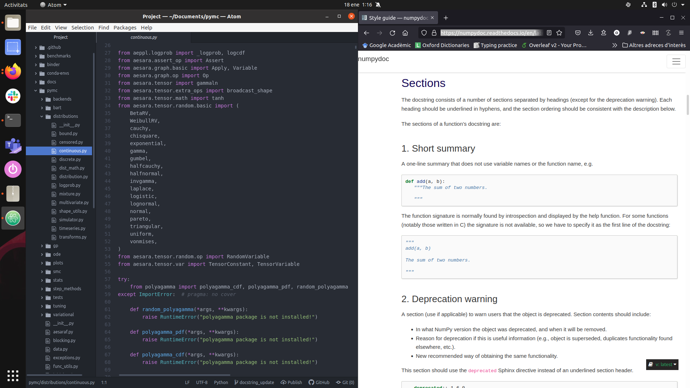

(docstring_tutorial)=
# Your first contribution to PyMC
This tutorial will guide you in submitting your first {abbr}`PR (Pull Request)` to the [pymc](https://github.com/pymc-devs/pymc)
repository.
We have tried to cover all of the steps and to be clear with the expected result at each step is.

You will start cloning the pymc repository, installing the requirements you'll need to contribute,
making some changes to a docstring of your choice and submitting a pull request.


:::{admonition} Disclaimer
This is a tutorial as defined in [diataxis](https://diataxis.fr/tutorials/).
Here are some things to take into account:

* **Do I need to follow each step exactly as explained?** No, but we strongly recommend you follow them.
  Once you have submitted your first PR and feel comfortable with the process then you can start
  experimenting and making it your own.
* **Do I need to submit a docstring edit as my first PR?** No, but again, we strongly recommend you do.
  This will allow you to separate the contribution workflow from the contribution content.
  We will be able to help you out along the process much better if you follow these steps,
  as we'll have a clear idea of where you stand at all times. We believe this will help you
  get comfortable with the tooling and infrastructure (git, virtual environments, GitHub PRs and
  {abbr}`CI (Continuous Integration)`) as quickly as possible
  so you can then focus on the content of your next PRs.
* **Will I understand the reasons for each step?** No, the goal of this tutorial is to
  teach you to do and through doing.
:::

If you prefer video to written content you can watch {ref}`Reshama <organizers>`
go over this guide and submit a PR to PyMC in the following video:

:::{youtube} NbmdFJsnuuo
:::

## Pre-requisites

### GitHub account
To contribute you'll need a GitHub account. You can create one from [this link](https://github.com/join)

::::{sidebar} New to Git and GitHub?
We have tried to cover all the steps and include both input and output, to make
sure you can follow this tutorial without knowing Git.
However, if you want to learn about Git and understand what is going on,
we recommend [this dataschool tutorial](https://www.dataschool.io/how-to-contribute-on-github/)
::::

### Install Git

::::{tab-set}
:::{tab-item} Linux
:sync: linux
Instructions with installation commands for most Linux distributions
can be found on the [Git project website](https://git-scm.com/download/linux)
:::
:::{tab-item} macosx
:sync: macos
Instructions with installation commands for macosx
can be found on the [Git project
website](https://git-scm.com/book/en/v2/Getting-Started-Installing-Git#_installing_on_macos)
:::
:::{tab-item} Windows
:sync: windows
The recommended way to install Git is using [Git for Windows](https://git-scm.com/download/win).
:::
::::

### Install conda
We recommend you install miniconda and follow the steps below to install only
the libraries you'll need.

::::{tab-set}
:::{tab-item} Linux
:sync: linux
Miniconda installation instructions for linux are available on the [conda website](https://conda.io/projects/conda/en/latest/user-guide/install/linux.html)
:::
:::{tab-item} macosx
:sync: macos
Miniconda installation instructions for macosx are available on the [conda website](https://conda.io/projects/conda/en/latest/user-guide/install/macos.html)
:::
:::{tab-item} Windows
:sync: windows
Miniconda installation instructions for windows are available on the [conda website](https://conda.io/projects/conda/en/latest/user-guide/install/windows.html)
:::
::::

### Text editor
You might already have a text editor installed. Check if you have any editor from
the list below, otherwise install _one_, any will do:

* [Atom](https://atom.io/)
* [Visual Studio Code](https://code.visualstudio.com/)
* [Sublime text](https://www.sublimetext.com/)
* [PyCharm (community)](https://www.jetbrains.com/pycharm/download)

## Fork the pymc repo
Fork the [project repository](https://github.com/pymc-devs/pymc/)
by clicking on the 'Fork' button near the top right of the main repository page.


This creates a copy of the code under your GitHub user account.
You should now see that `https://github.com/<your GitHub handle>/pymc/` exists

## Open a command line interface
This should come with your operative system or have been installed when
setting up Git and miniconda.

## Clone the pymc repo
Clone your fork. This will create a `pymc` folder wherever
you are, make sure to be at the location where you want
the folder to be created.

```bash
git clone git@github.com:<your GitHub handle>/pymc.git
```
This command should start immediately but it can take a while to finish.
Its output should look similar to the prompt below
(the exact numbers can change and
it will be in the language or your computer which probably won't be Catalan):

```none
S'està clonant a «pymc»...
remote: Enumerating objects: 53490, done.
remote: Counting objects: 100% (212/212), done.
remote: Compressing objects: 100% (154/154), done.
remote: Total 53490 (delta 104), reused 107 (delta 58), pack-reused 53278
S'estan rebent objectes: 100% (53490/53490), 728.53 MiB | 10.04 MiB/s, fet.
S'estan resolent les diferències: 100% (39445/39445), fet.
```

Enter inside the directory containing your local clone of the pymc repo,
then tell git this is a fork of the one in the pymc-devs organization:

```bash
cd pymc
git remote add upstream git@github.com:pymc-devs/pymc.git
```

None of these commands generate any output. To check they have worked type

```bash
git remote
```
and check that the output is:
```none
origin
upstream
```

## Choose a docstring
Go to the [PyMC API documentation](https://docs.pymc.io/en/latest/api.html),
click on the module (and submodule if needed) that calls you the most
and choose a docstring on which to work.

:::{note}
This tutorial follows the process of updating `pymc.Uniform` and pairs
general comments about updating docstrings with specific comments
about applying those changes to `pymc.Uniform`.

The docstring is available at the {ref}`sample_docstring` page, I updated
the docstring in PyMC while writing this guide.
:::

Once you have chosen, go to our [issue tracker (TODO: create issue)](https://github.com/pymc-devs/pymc/issues),
check nobody is already working on it and comment that you are going to update it.

:::{important}
Remember that function and keep the tab open (or save the link for later)
:::

## Create a feature branch

```bash
git checkout -b docstring_update
```
and check git indicates you the branch change was successful:
```none
S'ha canviat a la branca nova «docstring_update»
```

:::{tip}
Keep your branch names informative, use one branch per PR and **never**
work on `main`.
:::

:::{admonition} Getting ready for the 2nd PR?
:class: dropdown, attention

If you haven't changed to a different branch, you'll still be in the `docstring_update` one,
but you don't want to work there! Remember, one branch per PR.

_Before_ starting to work on the new changes, move back to main,
update your local copy and then create the new branch.

```
git checkout main
git fetch upstream
git rebase upstream/main
git checkout -b branch_for_2nd_pr
```
:::


## Install PyMC

::::{tab-set}
:::{tab-item} Linux
:sync: linux
```bash
conda env create -f conda-envs/environment-dev-py38.yml
```
:::
:::{tab-item} macosx
:sync: macos
```bash
conda env create -f conda-envs/environment-dev-py38.yml
```
:::
:::{tab-item} Windows
:sync: windows
```
conda env create -f conda-envs/windows-environment-dev-py38.yml
```
:::
::::

This command can also take a while, but should start writing output
immediately. If it finishes successfully, the last lines printed will
be:

```none
done
#
# To activate this environment, use
#
#     $ conda activate pymc-dev-py38
#
# To deactivate an active environment, use
#
#     $ conda deactivate
```

Activate the environment and install pymc:
```bash
conda activate pymc-dev-py38
```
This command has no output, but generally adds the environment
name to the start of the command line. If you want, you can check
it has worked with the command `conda list` which should print
all the packages installed, starting with:

```none
# packages in environment at /home/oriol/miniconda3/envs/pymc-dev-py38:
#
# Name                    Version                   Build  Channel
_libgcc_mutex             0.1                 conda_forge    conda-forge
_openmp_mutex             4.5                       1_gnu    conda-forge
aeppl                     0.0.18             pyhd8ed1ab_0    conda-forge
aesara                    2.3.2            py38hdc754fd_0    conda-forge
```

Install PyMC:
```bash
pip install -e .
```
We already installed all the dependencies so this should not take long.
If successful, the last printed line will be

```none
Successfully installed pymc-4.0.0b2
```

Then activate `pre-commit`. It will help auto formatting the code for you.

```bash
pip install pre-commit
pre-commit install
```
on success will show
```none
pre-commit installed at .git/hooks/pre-commit
```

## Open the file with your text editor
Open the file containing the docstring you chose to edit with your text editor.
The file will be inside the `pymc` folder, but it probably won't be
straightforward to guess just from the name of the function or class.

Go back to the API page and click on the "[source]" button at the right
of the call signature.


Now take a look at the url. Here is what it shows for {class}`pymc.Uniform`:

```none
https://docs.pymc.io/en/latest/_modules/pymc/distributions/continuous.html#Uniform
```

The file with the definition of the `Uniform` class and its docstring is
`pymc/distributions/continuous.py`, the path that comes after `_modules`
with a `.py` extension.

## Edit the docstring
The changes you have to do are making sure that the docstring is
following [numpydoc](https://numpydoc.readthedocs.io/en/latest/format.html#sections)
convention. We have some extra conventions on top of that, which I have explained here but they are
only relevant for some sections, most of the time you'll follow numpydoc directly.

Open the [numpydoc style guide](https://numpydoc.readthedocs.io/en/latest/format.html#sections)
side by side or in a different window.
I am updating the docstring of {ref}`pymc.Uniform <sample_docstring>` as an example.

Here is what I see having both side by side, using the Atom editor:



You have to review section by section to make sure everything is well documented.
If you have chosen a class (like I did with `pymc.Uniform`),
you should review the docstrings of all the methods (if they already exist, no need
to write missing docstrings yet).

**Section independent comments**
* Only the short summary section is required. The rest should be used when
  relevant. As a rule, if a section is missing, ignore it for now.
  If you think it should be added, take a note and let us know when you
  open the PR.
* If you find instances of the plot directive `.. plot::`, make sure they are
  either on the extended summary or examples section and that they use the
  `close-figs` context. It should look like:

  ```none
  .. plot::
      :context: close-figs

      python code starts here
  ```

### Short summary
* _General comments:_ Make sure there is a (preferably single line) short description of the
  object. In most cases you'll need to ignore the "not use variable names or the function name"
  rule.
* _pymc.Uniform case:_ {fas}`check`
* _logcdf method:_ A bit long but acceptable.

### Deprecation warning
* _General comments:_ There should be no deprecation warnings, we use a decorator for that.
  If you find a docstring with one, take a note, do not modify it and let us know when
  you open the PR.
* _pymc.Uniform case:_ {fas}`check`
* _logcdf method:_ {fas}`check`

### Extended summary
* _General comments:_ This section is quite free and will probably need no modifications
  other than maybe directive updates or moving some code to the notes section.
* _pymc.Uniform case:_ Missing close figs in the plot directive.
* _logcdf method:_ {fas}`check`

### Parameters
* _General comments:_ This is the section that will most probably need more work. Points
  to add or emphasize in addition to the advise on numpydoc:
  - The colon between an argument name and it's type must be both **preceded and followed**
    by a space.
  - Type hints should go in the call signature, not in the docstring. `Optional[Union[str, int]]`
    is not adequate for a docstring, it should be `str or int, optional`
  - Optional parameters must be indicated with `, optional` (no variations on this) and
    must indicate the default parameters in the description unless they are clearly
    visible in the call signature.
  - In type descriptions:
    - Change `tensor`, `aesara tensor` (including combinations with different capitalization,
      dot or hyphen in between) to `TensorVariable`, without extra quotes or backticks
    - Change `var`, `random var`, `aesara var` and similar concepts should be `RandomVariable`
    - Change `array like` or `array-like` to `array_like` with an underscore.
    - Change `np.ndarray` or `numpy.ndarray` to `ndarray`
* _pymc.Uniform case:_
  - There is no space between argument name and colon
  - Both arguments are actually optional. In Distributions, this can't be seen
    in the class itself but in the `dist` method. In the Uniform case, it
    is `dist(cls, lower=0, upper=1, **kwargs)`. Therefore they are both optional
    with defaults to 0 and 1 respectively.
* _logcdf method:_
  - `value` type description uses `np.ndarray` -> `ndarray` and
    `` `TensorVariable` ``, which should not have backticks. It
    is also missing the space before the colon.
  - lower and upper are missing from the docstring. Here you can take their
    descriptions from the class docstring. In other cases it will probably not
    be clear what to write for those, just note them down and comment when opening
    the PR.

### Returns and yields
* _General comments:_ Nothing to add to numpydoc. They follow the style of the
  parameters section but with the argument name being optional for single
  outputs. You should look for the same things detailed in parameters section
  plus making sure that the type (plus name if any) and the description are on
  different lines.
* _pymc.Uniform case:_ {fas}`check`
* _logcdf method:_ {fas}`check`

## Commit the changes to git
Add the changes to your local copy and give a name to the changes.
Keep the name short yet informative, for example:

```bash
git commit -a -m "Updated pymc.Uniform docstring"
```
pre-commit will check and fix common formatting issues,
and before doing this it needs to set up. So this can take a bit.

If all the checks pass, the end of the printed output will look like:
```none
Check no tests are ignored...........................(no files to check)Skipped
Generate pip dependency from conda...................(no files to check)Skipped
No relative imports......................................................Passed
[docstring_update 2de5cc0a] Updated pymc.Uniform docstring
 1 files changed, 7 insertions(+), 5 deletions(-)
```

If some checks fail, there are two options:

* pre-commit is able to fix the file
  ```none
  isort....................................................................Failed
  - hook id: isort
  - files were modified by this hook

  Fixing /home/oriol/Documents/pymc/pymc/sampling.py
  ```

  If this is the case for all fails, you only need to run the same command
  again, and now checks will pass:

  ```bash
  git commit -a -m "Updated pymc.Uniform docstring"
  ```
* pre-commit is not able to fix the file
  ```none
  No relative imports......................................................Failed
  - hook id: no-relative-imports
  - exit code: 1

  pymc/sampling.py:89:from .aesaraf import change_rv_size, compile_pymc, inputvars, walk_model
  ```

  If some fail has this message then it needs manual input.
  Ask on Discourse sharing this piece copied from your terminal.
  It needs to include the check name and all fail messages.

## Upload (push) the changes to GitHub
Then push the changes to your GitHub account with:

```bash
git push -u origin docstring_update
```
The output will look like:
```none
S'estan enumerant els objectes: 40, fet.
S'estan comptant els objectes: 100% (40/40), fet.
Delta compression using up to 8 threads
S'estan comprimint els objectes: 100% (21/21), fet.
S'estan escrivint els objectes: 100% (22/22), 2.88 KiB | 2.88 MiB/s, fet.
Total 22 (diferències 15), reusat 0 (diferències 0)
remote: Resolving deltas: 100% (15/15), completed with 14 local objects.
remote:
remote: Create a pull request for 'docstring_update' on GitHub by visiting:
remote:      https://github.com/OriolAbril/pymc/pull/new/docstring_update
remote:
To github.com:OriolAbril/pymc.git
 * [new branch]        docstring_update -> docstring_update
La branca «docstring_update» està configurada per a seguir la branca remota «docstring_update» de «origin».
```

## Create a Pull Request
You will have noticed that the message already indicates how to open a PR
and even provides a link. Click on the link (you might need to use right click
plus "Open link") and take a look at the page shown in your browser

Your screen at this point will be similar to:


Before clicking on the "Create pull request" button, check a couple things.

* Make sure the title is informative. If you followed the advise here, it should
  already be as it defaults to the commit message.
* Edit the description. You can remove all the points in the checklist except the
  one about the release notes. Then add a link to the issue you commented on.
* If you have taken any notes while updating the docstring add them to the PR description.
* Make sure the "Allow edits and access to secrets by maintainers" button is checked
  (it generally is checked by default)

You might also see a link to the `CONTRIBUTING.md` file. You don't need to read it yet,
this guide includes everything in the contributing guide that is relevant to this
type of contribution. If your second PR is also on the pymc repo, then you
should read the `CONTRIBUTING.md` guide there. However, if your second PR is
to the pymc-examples repo instead, you have to read its (slightly different)
`CONTRIBUTING.md`.

Click on "Create pull request" and celebrate for a bit 🎉, but the work is not finished.

## Get ready for reviews
Now you have to wait for someone on the PyMC team to review. If you have sent the
PR during sprint hours, we'll get to it fast (but not immediately, we might be
reviewing someone else's PR!), if you are doing this ahead of of the sprint,
it will probably take several hours before someone sees it and reviews it.

We'll probably make some extra comments about things to change, this is not
a bad sign. We don't expect you to know everything on the first try, and
also, there might be further improvements like adding some `See Also` references
that require a lot of familiarity with the code base.

If you need to address some comments, you will have to modify your local copy of
the files (still on the same branch).
Once you are finished, commit again (same command but different message):

```bash
git commit -a -m "address review comments"
```

Now you can push with:

```bash
git push
```

The remote and branch name are only needed the first time. After pushing you should
see that the PR on GitHub has been updated.

Your PR will be merged as soon as possible after that and you can now properly
celebrate your merged PR to PyMC! Thanks for contributing!

:::{div} sd-text-center sd-fs-1
{fas}`heart;sd-fs-1 sd-text-danger`
:::
