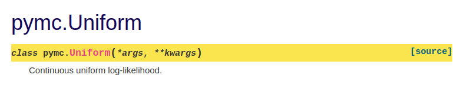

(docstring_tutorial)=
# Your first contribution to PyMC
This tutorial will guide you in submitting your first {abbr}`PR (Pull Request)` to the [pymc](https://github.com/pymc-devs/pymc)
repository.
We have tried to cover all of the steps and to be clear with the expected result at each step is.

You will start cloning the pymc repository, installing the requirements you'll need to contribute,
making some changes to a docstring of your choice and submitting a pull request.


:::{admonition} Disclaimer
This is a tutorial as defined in [diataxis](https://diataxis.fr/tutorials/).
Here are some things to take into account:

* **Do I need to follow each step exactly as explained?** No, but we strongly recommend you follow them.
  Once you have submitted your first PR and feel comfortable with the process then you can start
  experimenting and making it your own.
* **Do I need to submit a docstring edit as my first PR?** No, but again, we strongly recommend you do.
  This will allow you to separate the contribution workflow from the contribution content.
  We will be able to help you out along the process much better if you follow these steps,
  as we'll have a clear idea of where you stand at all times. We believe this will help you
  get comfortable with the tooling and infrastructure (git, virtual environments, GitHub PRs and
  {abbr}`CI (Continuous Integration)`) as quickly as possible
  so you can then focus on the content of your next PRs.
* **Will I understand the reasons for each step?** No, the goal of this tutorial is to
  teach you to do and through doing.
:::

If you prefer video to written content you can watch {ref}`Reshama <organizers>`
go over this guide and submit a PR to PyMC in the following video:

:::{youtube} NbmdFJsnuuo
:::

## Prepare your environment

If you don't have your system configured yet, you can follow the instructions in the {ref}`Environment Setup <environment_setup>` tutorial.

## Choose a docstring
Go to the [PyMC API documentation](https://docs.pymc.io/en/latest/api.html),
click on the module (and submodule if needed) that calls you the most
and choose a docstring on which to work.

:::{note}
This tutorial follows the process of updating `pymc.Uniform` and pairs
general comments about updating docstrings with specific comments
about applying those changes to `pymc.Uniform`.

The docstring is available at the {ref}`sample_docstring` page, I updated
the docstring in PyMC while writing this guide.
:::

Once you have chosen, go to our [issue tracker](https://github.com/pymc-devs/pymc/issues/5459),
check nobody is already working on it and comment that you are going to update it.

:::{important}
Remember that function and keep the tab open (or save the link for later)
:::

## Open the file with your text editor
Open the file containing the docstring you chose to edit with your text editor.
The file will be inside the `pymc` folder, but it probably won't be
straightforward to guess just from the name of the function or class.

Go back to the API page and click on the "[source]" button at the right
of the call signature.



Now take a look at the url. Here is what it shows for {class}`pymc.Uniform`:

```none
https://docs.pymc.io/en/latest/_modules/pymc/distributions/continuous.html#Uniform
```

The file with the definition of the `Uniform` class and its docstring is
`pymc/distributions/continuous.py`, the path that comes after `_modules`
with a `.py` extension.

## Edit the docstring
The changes you have to do are making sure that the docstring is
following [numpydoc](https://numpydoc.readthedocs.io/en/latest/format.html#sections)
convention. We have some extra conventions on top of that, which I have explained here but they are
only relevant for some sections, most of the time you'll follow numpydoc directly.

Open the [numpydoc style guide](https://numpydoc.readthedocs.io/en/latest/format.html#sections)
side by side or in a different window.
I am updating the docstring of {ref}`pymc.Uniform <sample_docstring>` as an example.

You have to review section by section to make sure everything is well documented.
If you have chosen a class (like I did with `pymc.Uniform`),
you should review the docstrings of all the methods (only if they already exist though, no need
to write missing docstrings). I am therefore ignoring the `dist` and `get_moment` methods.

### Section independent comments
* Only the short summary section is required. The rest should be used when
  relevant. As a rule, if a section is missing, ignore it for now.
  If you think it should be added, take a note and let us know when you
  open the PR.
* If you find instances of the plot directive `.. plot::`, make sure they are
  either on the extended summary or examples section and that they use the
  `close-figs` context. It should look like:

  ```none
  .. plot::
      :context: close-figs

      python code starts here
  ```

### Short summary
* _General comments:_ Make sure there is a (preferably single line) short description of the
  object. In most cases you'll need to ignore the "not use variable names or the function name"
  rule.
* _pymc.Uniform case:_ {fas}`check`
* _logcdf method:_ A bit long but acceptable.

### Deprecation warning
* _General comments:_ There should be no deprecation warnings, we use a decorator for that.
  If you find a docstring with one, take a note, do not modify it and let us know when
  you open the PR.
* _pymc.Uniform case:_ {fas}`check`
* _logcdf method:_ {fas}`check`

### Extended summary
* _General comments:_ This section is quite free and will probably need no modifications
  other than maybe directive updates or moving some code to the notes section.
* _pymc.Uniform case:_ Missing close figs in the plot directive.
* _logcdf method:_ {fas}`check`

### Parameters
* _General comments:_ This is the section that will most probably need more work. Points
  to add or emphasize in addition to the advise on numpydoc:
  - The colon between an argument name and it's type must be both **preceded and followed**
    by a space.
  - Type hints should go in the call signature, not in the docstring. `Optional[Union[str, int]]`
    is not adequate for a docstring, it should be `str or int, optional`. Type
    hints target machines, docstrings target humans.
  - Optional parameters must be indicated with `, optional` or `, default <value>`.
    If the default value is of the documented type and used directly, using default
    instead of optional is preferred. However, if the default value depends on
    other parameters or is a placeholder (i.e. it is very common to use `None`
    for kwarg type arguments) then optional should be used, explaining the default in
    the description.
  - In type descriptions. We have several aliases available to keep raw docstrings
    short and clear while generating still a nice html page with all the correct links:
    - **`TensorVariable`:** Change `tensor`, `aesara tensor` (including combinations with different capitalization,
      dot or hyphen in between) to `TensorVariable`, without extra quotes or backticks
    - **`RandomVariable`:** Change `var`, `random var`, `aesara var` and similar concepts should be `RandomVariable`
    - **`array_like`:** Change `array like` or `array-like` to `array_like` with an underscore.
      If you encounter this in a returned parameter, note it in the PR description.
    - **`ndarray`:** Change `np.ndarray` or `numpy.ndarray` to `ndarray`. However,
      if you encounter this in an input argument, note it in the PR description.
    - **`Covariance`** and **`Mean`**: _within the gp module only_ `covariance`,
      `covariance objects`, `Covariance instances` and the like should be modified
      to this. Same for `Mean`
    - **`InferenceData`**: change things like `arviz.InferenceData` or `inference data` to this.
    - **`MultiTrace`** and **`BaseTrace`**: change anything containing this in
      the type to them. The most probable thing to find is `pymc.backends.base.MultiTrace`
    - **`Point`**: change `pymc.Point`, `point` and similars to this
    - **`SMC_kernel`**: _within the smc module_ change references to kernel, smc kernel and the like
      to this. Note the underscore and capitalization!
    - **`Aesara_Op`**: change `Aesara Op`, `Op` and variations to `Aesara_Op`, note
      the underscore and capitalization!
* _pymc.Uniform case:_
  - There is no space between argument name and colon
  - Both arguments are actually optional. In Distributions, this can't be seen
    in the class itself but in the `dist` method. In the Uniform case, it
    is `dist(cls, lower=0, upper=1, **kwargs)`. Therefore they are both optional
    with defaults to 0 and 1 respectively.
* _logcdf method:_
  - `value` type description uses `np.ndarray` -> `ndarray` and
    `` `TensorVariable` ``, which should not have backticks. It
    is also missing the space before the colon.
  - lower and upper are missing from the docstring. Here you can take their
    descriptions from the class docstring. In other cases it will probably not
    be clear what to write for those, just note them down and comment when opening
    the PR.

### Returns and yields
* _General comments:_ Nothing to add to numpydoc. They follow the style of the
  parameters section but with the argument name being optional for single
  outputs. You should look for the same things detailed in parameters section
  plus making sure that the type (plus name if any) and the description are on
  different lines.
* _pymc.Uniform case:_ {fas}`check`
* _logcdf method:_ {fas}`check`

## Commit the changes to git and get your PR ready

Great! You are ready to do your PR now. 

You can follow the {ref}`PR Tutorial <pr_tutorial>` which explains how you can do a PR to PyMC.

Your PR will be reviewed and hopefully merged by the PyMC team. After that, you can  properly celebrate your first contribution to PyMC! Thanks for contributing!

:::{div} sd-text-center sd-fs-1
{fas}`heart;sd-fs-1 sd-text-danger`
:::
