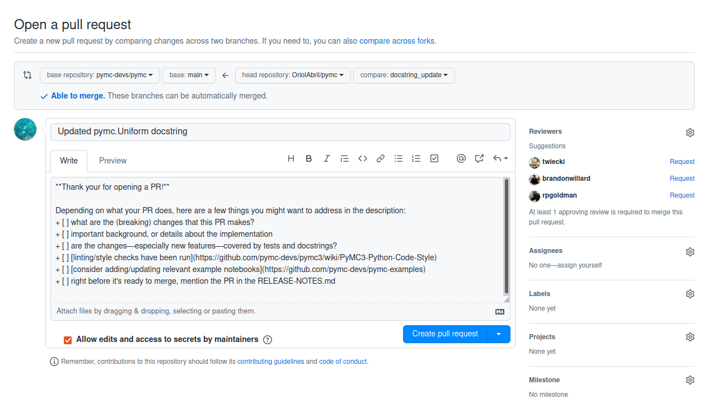

(pr_tutorial)=
# Creating a Pull Request

In this guide we will be creating a pull request for the PyMC project.


## Create a feature branch

```bash
git checkout -b docstring_update
```
and check git indicates you the branch change was successful:
```none
S'ha canviat a la branca nova «docstring_update»
```

:::{tip}
Keep your branch names informative, use one branch per PR and **never**
work on `main`.
:::

## Commit the changes to git

Add the changes to your local copy and give a name to the changes.
Keep the name short yet informative, for example:

```bash
git commit -a -m "Updated pymc.Uniform docstring"
```
pre-commit will check and fix common formatting issues,
and before doing this it needs to set up. So this can take a bit.

If all the checks pass, the end of the printed output will look like:
```none
Check no tests are ignored...........................(no files to check)Skipped
Generate pip dependency from conda...................(no files to check)Skipped
No relative imports......................................................Passed
[docstring_update 2de5cc0a] Updated pymc.Uniform docstring
 1 files changed, 7 insertions(+), 5 deletions(-)
```

If some checks fail, there are two options:

* pre-commit is able to fix the file
  ```none
  isort....................................................................Failed
  - hook id: isort
  - files were modified by this hook

  Fixing /home/oriol/Documents/pymc/pymc/sampling.py
  ```

  If this is the case for all fails, you only need to run the same command
  again, and now checks will pass:

  ```bash
  git commit -a -m "Updated pymc.Uniform docstring"
  ```
* pre-commit is not able to fix the file
  ```none
  No relative imports......................................................Failed
  - hook id: no-relative-imports
  - exit code: 1

  pymc/sampling.py:89:from .aesaraf import change_rv_size, compile_pymc, inputvars, walk_model
  ```

  If some fail has this message then it needs manual input.
  Ask on Discourse sharing this piece copied from your terminal.
  It needs to include the check name and all fail messages.

## Upload (push) the changes to GitHub

Then push the changes to your GitHub account with:

```bash
git push -u origin docstring_update
```
The output will look like:
```none
S'estan enumerant els objectes: 40, fet.
S'estan comptant els objectes: 100% (40/40), fet.
Delta compression using up to 8 threads
S'estan comprimint els objectes: 100% (21/21), fet.
S'estan escrivint els objectes: 100% (22/22), 2.88 KiB | 2.88 MiB/s, fet.
Total 22 (diferències 15), reusat 0 (diferències 0)
remote: Resolving deltas: 100% (15/15), completed with 14 local objects.
remote:
remote: Create a pull request for 'docstring_update' on GitHub by visiting:
remote:      https://github.com/OriolAbril/pymc/pull/new/docstring_update
remote:
To github.com:OriolAbril/pymc.git
 * [new branch]        docstring_update -> docstring_update
La branca «docstring_update» està configurada per a seguir la branca remota «docstring_update» de «origin».
```

## Create a Pull Request
You will have noticed that the message already indicates how to open a PR
and even provides a link. Click on the link (you might need to use right click
plus "Open link") and take a look at the page shown in your browser

Your screen at this point will be similar to:



Before clicking on the "Create pull request" button, check a couple things.

* Make sure the title is informative. If you followed the advise here, it should
  already be as it defaults to the commit message.
* Edit the description. You can remove all the points in the checklist except the
  one about the release notes. Then add a link to the issue you commented on.
* If you have taken any notes while updating the docstring add them to the PR description.
* Make sure the "Allow edits and access to secrets by maintainers" button is checked
  (it generally is checked by default)

You might also see a link to the `CONTRIBUTING.md` file. You don't need to read it yet,
this guide includes everything in the contributing guide that is relevant to this
type of contribution. If your second PR is also on the pymc repo, then you
should read the `CONTRIBUTING.md` guide there. However, if your second PR is
to the pymc-examples repo instead, you have to read its (slightly different)
`CONTRIBUTING.md`.

Click on "Create pull request" and celebrate for a bit 🎉, but the work is not finished.

## Get ready for reviews

Now you have to wait for someone on the PyMC team to review. If you have sent the
PR during sprint hours, we'll get to it fast (but not immediately, we might be
reviewing someone else's PR!), if you are doing this ahead of of the sprint,
it will probably take several hours before someone sees it and reviews it.

We'll probably make some extra comments about things to change, this is not
a bad sign. We don't expect you to know everything on the first try, and
also, there might be further improvements like adding some `See Also` references
that require a lot of familiarity with the code base.

If you need to address some comments, you will have to modify your local copy of
the files (still on the same branch).
Once you are finished, commit again (same command but different message):

```bash
git commit -a -m "address review comments"
```

Now you can push with:

```bash
git push
```

The remote and branch name are only needed the first time. After pushing you should
see that the PR on GitHub has been updated.

:

:::{admonition} Getting ready for the 2nd PR?
:class: dropdown, attention

If you haven't changed to a different branch, you'll still be in the `docstring_update` one,
but you don't want to work there! Remember, one branch per PR.

_Before_ starting to work on the new changes, move back to main,
update your local copy and then create the new branch.

```
git checkout main
git fetch upstream
git rebase upstream/main
git checkout -b branch_for_2nd_pr
```
:::

Your PR will be merged as soon as possible after that and you can properly
celebrate your merged PR to PyMC! Thanks for contributing!

:::{div} sd-text-center sd-fs-1
{fas}`heart;sd-fs-1 sd-text-danger`
:::
