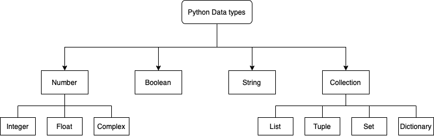

# Introduction to array operations in Python

This is a ~40 minute session to introduce you to array manipulation and basics of Python, which will be useful to contribute to computational open source libraries in Python. We have some specific aims in mind:

- Understanding basics of arrays, lists and datatypes in Python

- Using Python with Numpy

- Motivating you to contribute to Open source libraries in Python, especially PyMC

This event is a part of a larger series of PyMC - Data Umbrella events, which are aimed at helping you contribute to PyMC (Open source library for Probabilistic Programming in Python)

## Details

- Talk Level: Beginner
- Pre-requisites: Working knowledge of any object-oriented programming language
- [Github Repo](https://github.com/pymc-devs/pymc-data-umbrella/tree/main/webinars/getting_started_python_for_ds)

## Speaker

[Meenal](https://mjhajharia.com) is a computer science and mathematics undergraduate in junior year. She has been working on Bayesian time series estimation models with PyMC, this project started when she was a Google Summer of Code’21 student . Generally she is interested in Probabilistic Programming, NLP, and algorithms.

## Introduction to Array Operations in Python

### Meenal Jhajharia

```{thebe-button}

```

Overview

- Introduction
- Python Objects
- List Comprehension
- Basics of NumPy

#### Why Python?

- Useful for quick prototyping
- Dynamically Typed, Interpreted, High level data types
- Large number of scientific open source software

Best Place to learn more : [Official Python Guide](https://wiki.python.org/moin/BeginnersGuide/Programmers)

#### Let's get started

Here's what you need to begin

- Github Repo: [pymc-devs/pymc-data-umbrella](https://github.com/pymc-devs/pymc-data-umbrella)
- Working installation of Python3
- A terminal (Windows or Unix)
- Knowledge of an OOP would be nice to have



#### Numbers

Certain numeric modules ship with Python

```{code-block}
:class: thebe
import random
random.random()
```

#### Strings

Sequence Operations

```{code-block}
:class: thebe
X = 'Data'
len(X)
```

```{code-block}
:class: thebe
X[0:-2]
```

#### Immutability

Immutable objects cannot be changed

```{code-block}
:class: thebe
X = 'Data'
X + 'Umbrella'
```

```{code-block}
:class: thebe
X[0] = 'P'
```

#### Polymorphism

Operators or functions mean different things for different objects

```{code-block}
:class: thebe
1+2
```

```{code-block}
:class: thebe
'Py'+'MC'
```

Length or size means different things for different datatypes

```{code-block}
:class: thebe
len("Python")
```

```{code-block}
:class: thebe
len(["Python", "Java", "C"])
```

```{code-block}
:class: thebe
len({"Language": "Python", "IDE": "VSCode"})
```

Related: Class Polymorphism, Method Overriding and Inheritance

#### Lists

Positionally ordered collections of arbitrarily typed objects (mutable, no fixed size)

```{code-block}
:class: thebe
L = ['Python', 45, 1.23]
len(L)
```

```{code-block}
:class: thebe
L + [4, 5, 6]
```

```{code-block}
:class: thebe
L[-1]
```

List-specific operations

```{code-block}
:class: thebe
L.append('Aesara');L
```

```{code-block}
:class: thebe
L.pop(2); L
```

```{code-block}
:class: thebe
L + [4, 5, 6]
```

More: sort(), reverse()

List Indexing

```{code-block}
:class: thebe
L[99]
```

```{code-block}
:class: thebe
X = [[1,2],[2,1]]
print(len(X), len(X[0]))
```

```{code-block}
:class: thebe
X[0][0]
```

#### List Comprehension

```{code-block}
:class: thebe
M = [['OS','Percentage of Users'],['Linux', '40'],['Windows', '20'], ['OSX','40']]
```

```{code-block}
:class: thebe
[row[0] for row in M][1:]
```

```{code-block}
:class: thebe
[row[0] + '*' for row in M][1:]
```

```{code-block}
:class: thebe
[row[0] for row in M if row[0][0]!='O']#### List Comprehension
```

```{code-block}
:class: thebe
n = 3
[[ 1 if i==j else 0 for i in range(n) ] for j in range(n)]
```

#### NumPy

NumPy’s array class -> ndarray(array)

- ndarray.ndim
- ndarray.shape
- ndarray.size

```{code-block}
:class: thebe
import numpy as np

a = np.arange(16).reshape(4, 4)
```

```{code-block}
:class: thebe
a
```
Simple array operation

```{code-block}
:class: thebe
2*a
```

General Properties of ndarrays

```{code-block}
:class: thebe
a.shape
```

```{code-block}
:class: thebe
a.ndim
```

```{code-block}
:class: thebe
a.size
```

Ways to create new arrays

```{code-block}
:class: thebe
a = np.array(['PyMC', 'Arviz', 'Aesara'])
```

```{code-block}
:class: thebe
np.zeros((4, 4))
```

```{code-block}
:class: thebe
np.ones((4, 4))
```

Generate values in a certain range

```{code-block}
:class: thebe
np.arange(1, 100, 10)
```

#### Random Number Generator

```{code-block}
:class: thebe
rg = np.random.default_rng(1)
x = rg.random(3);x

```
Cumulative sum against specified axis (in this case only one axis is present)

```{code-block}
:class: thebe
x.cumsum()
```

Multi-dimensional arrays

```{code-block}
:class: thebe
c = np.array([[[  0,  1,  2],  # a 3D array (two stacked 2D arrays)
[ 10, 12, 13]],
[[100, 101, 102],
[110, 112, 113]]])
```

```{code-block}
:class: thebe
c.shape
```

```{code-block}
:class: thebe
for row in c:
    print(row)
```

Element-wise printing
```{code-block}
:class: thebe
for row in c.flat:
    print(row)
```

Transpose

```{code-block}
:class: thebe
c.T
```

Reshape

```{code-block}
:class: thebe
c.reshape((12,1))
```

#### Stacking

```{code-block}
:class: thebe
a = np.ones((2,2))
b = np.zeros((2,2))
```

```{code-block}
:class: thebe
np.vstack((a, b))
```

```{code-block}
:class: thebe
np.hstack((a, b))
```

#### Broadcasting

used to deal with inputs that do not have exactly the same shape

- if all input arrays do not have the same number of dimensions, a “1” will be repeatedly prepended to the shapes of the smaller arrays until all the arrays have the same number of dimensions.
- arrays with a size of 1 along a particular dimension act as if they had the size of the array with the largest shape along that dimension. The value of the array element is assumed to be the same along that dimension for the “broadcast” array.

Arrays with same dimensions

```{code-block}
:class: thebe
a = np.array([1, 2, 3])
b = np.array([3, 3, 3])
a*b
```

1-d Array and a Scalar

```{code-block}
:class: thebe
a = np.array([1, 2, 3])
b = 3
a*b
```

intuitively: scalar b being "stretched" to same shape as a

reality:  broadcasting moves less memory around (computationally efficient)

Arrays where dimensions aren't exactly same, but are aligned along the leading dimension

```{code-block}
:class: thebe
a = np.ones((5,2,3))
b = np.ones((2,3))
a*b
```
Arrays where dimensions aren't exactly same, but leading dimension is 1, so it works

```{code-block}
:class: thebe
a = np.ones((5,2,1))
b = np.ones((2,3))
a*b
```
Broadcasting fails!

```{code-block}
:class: thebe
a = np.ones((5,2,2))
b = np.ones((2,3))
a*b
```

NumPy compares shapes element-wise for two given arrays

- It starts with the trailing (i.e. rightmost) dimensions
    Two dimensions are compatible when
  - they are equal, or
  - one of them is 1

Arrays do not need to have the same exact number of dimensions to be compatible. Broadcasting is a convenient way of taking the outer product (or any outer operation)

Here broadcasting fails because of the mismatch of leading dimensions

```{code-block}
:class: thebe
a = np.array([1,2,3,4])
b = np.array([1,2,3])
a*b
```

We transpose a to reshape it along a new axix

```{code-block}
:class: thebe
a = np.asarray([a]).T #a[:, np.newaxis]
a.shape
```

Now it works!

```{code-block}
:class: thebe
a*b
```

#### Indexing

```{code-block}
:class: thebe
a = np.array([0, 6, 9, 8, 8, 6, 2, 7, 2, 8, 1, 0, 4, 6, 9, 0])
i = np.array([1, 1, 2, 3])
```

```{code-block}
:class: thebe
a[i]
```

```{code-block}
:class: thebe
j = np.array([[3, 0], [2, 1]])
```

```{code-block}
:class: thebe
a[j]
```

```{code-block}
:class: thebe
a = a.reshape((4,4))
i = i.reshape((2,2))
```

```{code-block}
:class: thebe
a[i,j]
```

Next thing to look at -> <https://numpy.org/doc/stable/user/basics.html>

Note / Reference: A lot of the things here are modified/original versions of examples given in official Python or NumPy documentation, so that's the best source to learn comprehensively, this is meant to be an accessible introduction!!
