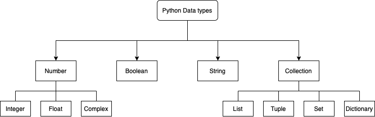

### Introduction to Array Operations in Python

#### Meenal Jhajharia

### Meenal Jhajharia. she/her.

- CS and Math undergrad, University of Delhi
- PyMC core contributor | GSoC student
- Contact: [meenal@mjhajharia.com](mailto:meenal@mjhajharia.com) | [mjhajharia.com](https://mjhajharia.com)

Overview

- Introduction
- Python Objects
- List Comprehension
- Basics of NumPy

<figure style="display: table; margin: 0 auto">
  <center>
    
  </center>
</figure>

#### Why Python?

- Useful for quick prototyping
- Dynamically Typed, Interpreted, High level data types
- Large number of scientific open source software

Best Place to learn more : [Official Python Guide](https://wiki.python.org/moin/BeginnersGuide/Programmers)

#### Let's get started!

Here's what you need to begin


- Github Repo: [pymc-devs/pymc-data-umbrella](https://github.com/pymc-devs/pymc-data-umbrella)
- Working installation of Python3
- A terminal (Windows or Unix)
- Knowledge of an OOP would be nice to have

<figure style="display: table; margin: 0 auto">
  <center>
    
  </center>
</figure>

#### Numbers

Certain numeric modules ship with Python


```python
import random
random.random()
```


    0.14105704520394058


#### Strings

Sequence Operations


```python
X = 'Data'
len(X)
```


    4


```python
X[0:-2]
```


    'Da'


#### Immutability

Immutable objects cannot be changed


```python
X = 'Data'
X + 'Umbrella'
```


    'DataUmbrella'


```python
X[0] = 'P'
```


    ---------------------------------------------------------------------------

    TypeError                                 Traceback (most recent call last)

    /var/folders/sd/pc07b3wn65nflgx8wpkkr7wr0000gn/T/ipykernel_1086/1913827336.py in <module>
    ----> 1 X[0] = 'P'


    TypeError: 'str' object does not support item assignment


#### Polymorphism

Operators or functions mean different things for different objects


```python
1+2
```


```python
'Py'+'MC'
```


    'PyMC'


#### Polymorphism


```python
len("Python")
```


    6


```python
len(["Python", "Java", "C"])
```


    3


```python
len({"Language": "Python", "IDE": "VSCode"})
```


    2


Related: Class Polymorphism, Method Overriding and Inheritance

#### Lists

Positionally ordered collections of arbitrarily typed objects (mutable, no fixed size)


```python
L = ['Python', 45, 1.23]
len(L)
```


    3


```python
L + [4, 5, 6]
```


    ['Python', 45, 1.23, 4, 5, 6]


```python
L[-1]
```


    1.23


Related: Class Polymorphism, Method Overriding and Inheritance

#### Lists

List-specific operations


```python
L.append('Aesara');L
```


    ['Python', 45, 1.23, 'Aesara']


```python
L.pop(2); L
```


    ['Python', 45, 'Aesara']


```python
L + [4, 5, 6]
```


    ['Python', 45, 'Aesara', 4, 5, 6]


More: sort(), reverse()

#### Lists

List-specific operations


```python
L[99]
```


    ---------------------------------------------------------------------------

    IndexError                                Traceback (most recent call last)

    /var/folders/sd/pc07b3wn65nflgx8wpkkr7wr0000gn/T/ipykernel_1086/2456052074.py in <module>
    ----> 1 L[99]


    IndexError: list index out of range


```python
X = [[1,2],[2,1]]
print(len(X), len(X[0]))
```

    2 2


```python
X[0][0]
```


    1


#### List Comprehension


```python
M = [['OS','Percentage of Users'],['Linux', '40'],['Windows', '20'], ['OSX','40']]
```


```python
[row[0] for row in M][1:]
```


    ['Linux', 'Windows', 'OSX']


```python
[row[0] + '*' for row in M][1:]
```


    ['Linux*', 'Windows*', 'OSX*']


```python
[row[0] for row in M if row[0][0]!='O']
```


    ['Linux', 'Windows']


#### List Comprehension


```python
n = 3
[[ 1 if i==j else 0 for i in range(n) ] for j in range(n)]
```


    [[1, 0, 0], [0, 1, 0], [0, 0, 1]]


#### NumPy

NumPy’s array class -> ndarray(array)

- ndarray.ndim
- ndarray.shape
- ndarray.size


```python
import numpy as np

a = np.arange(16).reshape(4, 4)
```


```python
a
```


    array([[ 0,  1,  2,  3],
           [ 4,  5,  6,  7],
           [ 8,  9, 10, 11],
           [12, 13, 14, 15]])


```python
2*a
```


    array([[ 0,  2,  4,  6],
           [ 8, 10, 12, 14],
           [16, 18, 20, 22],
           [24, 26, 28, 30]])


```python
a.shape
```


    (4, 4)


```python
a.ndim
```


    2


```python
a.size
```


    16


```python
a = np.array(['PyMC', 'Arviz', 'Aesara'])
```


```python
np.zeros((4, 4))
```


    array([[0., 0., 0., 0.],
           [0., 0., 0., 0.],
           [0., 0., 0., 0.],
           [0., 0., 0., 0.]])


```python
np.ones((4, 4))
```


    array([[1., 1., 1., 1.],
           [1., 1., 1., 1.],
           [1., 1., 1., 1.],
           [1., 1., 1., 1.]])


```python
np.arange(1, 100, 10)
```


    array([ 1, 11, 21, 31, 41, 51, 61, 71, 81, 91])


#### Random Number Generator


```python
rg = np.random.default_rng(1)
```


```python
x = rg.random(3);x
```


    array([0.51182162, 0.9504637 , 0.14415961])


```python
x.cumsum()
```


    array([0.51182162, 1.46228532, 1.60644493])


```python
c = np.array([[[  0,  1,  2],  # a 3D array (two stacked 2D arrays)
[ 10, 12, 13]],
[[100, 101, 102],
[110, 112, 113]]])
```


```python
c.shape
```


    (2, 2, 3)


```python
for row in c:
    print(row)
```

    [[ 0  1  2]
     [10 12 13]]
    [[100 101 102]
     [110 112 113]]


```python
for row in c.flat:
    print(row)
```

    0
    1
    2
    10
    12
    13
    100
    101
    102
    110
    112
    113


```python
c.T
```


    array([[[  0, 100],
            [ 10, 110]],

           [[  1, 101],
            [ 12, 112]],

           [[  2, 102],
            [ 13, 113]]])


```python
c.reshape((12,1))
```


    array([[  0],
           [  1],
           [  2],
           [ 10],
           [ 12],
           [ 13],
           [100],
           [101],
           [102],
           [110],
           [112],
           [113]])


#### Stacking


```python
a = np.ones((2,2))
b = np.zeros((2,2))
```


```python
np.vstack((a, b))
```


    array([[1., 1.],
           [1., 1.],
           [0., 0.],
           [0., 0.]])


```python
np.hstack((a, b))
```


    array([[1., 1., 0., 0.],
           [1., 1., 0., 0.]])


#### Broadcasting

used to deal with inputs that do not have exactly the same shape

- if all input arrays do not have the same number of dimensions, a “1” will be repeatedly prepended to the shapes of the smaller arrays until all the arrays have the same number of dimensions.
- arrays with a size of 1 along a particular dimension act as if they had the size of the array with the largest shape along that dimension. The value of the array element is assumed to be the same along that dimension for the “broadcast” array.


```python
a = np.array([1, 2, 3])
b = np.array([3, 3, 3])
a*b
```


    array([3, 6, 9])


```python
a = np.array([1, 2, 3])
b = 3
a*b
```


    array([3, 6, 9])


intuitively: scalar b being "stretched" to same shape as a

reality:  broadcasting moves less memory around (computationally efficient)


```python
a = np.ones((5,2,3))
b = np.ones((2,3))
a*b
```


    array([[[1., 1., 1.],
            [1., 1., 1.]],

           [[1., 1., 1.],
            [1., 1., 1.]],

           [[1., 1., 1.],
            [1., 1., 1.]],

           [[1., 1., 1.],
            [1., 1., 1.]],

           [[1., 1., 1.],
            [1., 1., 1.]]])


```python
a = np.ones((5,2,1))
b = np.ones((2,3))
a*b
```


    array([[[1., 1., 1.],
            [1., 1., 1.]],

           [[1., 1., 1.],
            [1., 1., 1.]],

           [[1., 1., 1.],
            [1., 1., 1.]],

           [[1., 1., 1.],
            [1., 1., 1.]],

           [[1., 1., 1.],
            [1., 1., 1.]]])


```python
a = np.ones((5,2,2))
b = np.ones((2,3))
a*b
```


    ---------------------------------------------------------------------------

    ValueError                                Traceback (most recent call last)

    /var/folders/sd/pc07b3wn65nflgx8wpkkr7wr0000gn/T/ipykernel_1086/2083074354.py in <module>
          1 a = np.ones((5,2,2))
          2 b = np.ones((2,3))
    ----> 3 a*b


    ValueError: operands could not be broadcast together with shapes (5,2,2) (2,3)


NumPy compares shapes element-wise for two given arrays

- It starts with the trailing (i.e. rightmost) dimensions
    Two dimensions are compatible when
    - they are equal, or
    - one of them is 1


Arrays do not need to have the same exact number of dimensions to be compatible

Broadcasting provides a convenient way of taking the outer product (or any other outer operation) of two arrays. The following example shows an outer addition operation of two 1-d arrays:


```python
a = np.array([1,2,3,4])
b = np.array([1,2,3])
```


```python
a*b
```


    ---------------------------------------------------------------------------

    ValueError                                Traceback (most recent call last)

    /var/folders/sd/pc07b3wn65nflgx8wpkkr7wr0000gn/T/ipykernel_1086/3507077656.py in <module>
    ----> 1 a*b


    ValueError: operands could not be broadcast together with shapes (4,) (3,)


```python
a = np.asarray([a]).T #a[:, np.newaxis]
```


```python
a.shape
```


    (4, 1)


```python
a*b
```


    array([[ 1,  2,  3],
           [ 2,  4,  6],
           [ 3,  6,  9],
           [ 4,  8, 12]])


#### Indexing


```python
a = np.array([0, 6, 9, 8, 8, 6, 2, 7, 2, 8, 1, 0, 4, 6, 9, 0])
i = np.array([1, 1, 2, 3])
```


```python
a[i]
```


    array([6, 6, 9, 8])


```python
j = np.array([[3, 0], [2, 1]])
```


```python
a[j]
```


    array([[8, 0],
           [9, 6]])


```python
a = a.reshape((4,4))
i = i.reshape((2,2))
```


```python
a[i,j]
```


    array([[7, 8],
           [1, 6]])


Next Stop -> https://numpy.org/doc/stable/user/basics.html
